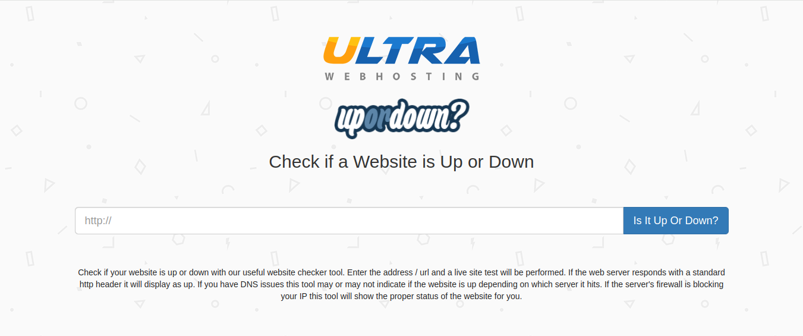

# Technical Dos attacks
Ethical Hacking - Dos attacks on different services.
<hr>

## The different tools
* Metasploit
* Nmap NSE
* Exploit database
* Scapy
<hr>

## DOS/DDOS categories
 * Session abuse.
 * Attacks based on packet volume.
 * Protocol-based attacks.
 * Attacks based on the application layer.
## The tools we are going to use
 * Low Orbit Ion Cannon
 * THC SSL DOS
 * Scapy 
 * Slowloris
 * https://upordown.ultrawebhosting.com/
 <hr>

 # let's try it
 ## 1st tool is a website : https://upordown.ultrawebhosting.com/

I will check if my site is available or not following service denial attacks.
https://samglishinc.000webhostapp.com

we see that the website is available.

## THC SSL DOS
```bash
thc-ssl-dos 
```
```
     ______________ ___  _________
     \__    ___/   |   \ \_   ___ \
       |    | /    ~    \/    \  \/
       |    | \    Y    /\     \____
       |____|  \___|_  /  \______  /
                     \/          \/
            http://www.thc.org

          Twitter @hackerschoice

Greetingz: the french underground

./thc-ssl-dos [options] <ip> <port>
  -h      help
  -l <n>  Limit parallel connections [default: 400]
```
how to use : `thc-ssl-dos ip_target --accept`

i want to test my website: 
let's see ip adress

run this command
```
dmitry samglishinc.000webhostapp.com
```
Output
```
Deepmagic Information Gathering Tool
"There be some deep magic going on"

HostIP:145.14.145.210
HostName:samglishinc.000webhostapp.com

Gathered Inet-whois information for 145.14.145.210
---------------------------------
```

